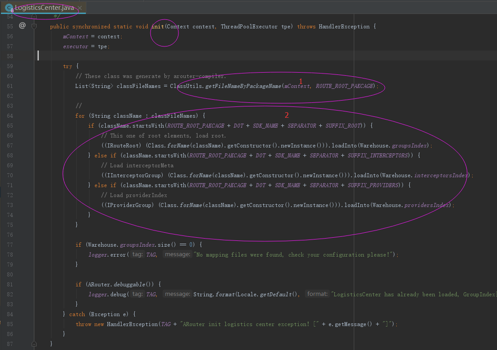
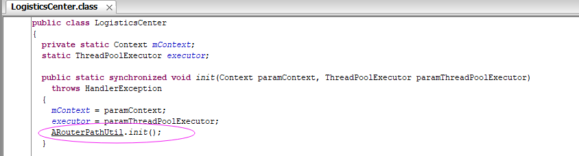
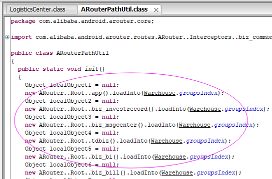

# ARouterOptimize
该插件可以用来优化ARouter在调用ARouter.init初始化的时候的速度。（仅适应于"arouter-api-1.2.1.1"版本）
## 原理
##### 1、扒开ARouter.init的代码,我们找到耗时的初始化代码位置在：     
     
可以看到耗时主要在第一点和第二点的位置：     
第一点是加载DEX文件找到所有的目标类，     
第二点是通过反射创建大量对象，   
这两点都是非常耗时的，如果要优化，我们需要把这些反射完全替换成源码    
##### 2、利用javassist，在编译期找出所有目标类，并在上述方法中，采用源码依赖，实现的效果如下图：   
    
   

## 使用方法
>注意: 仅适应于"arouter-api-1.2.1.1"版本       

在项目的gradle中配置：
```groovy
buildscript {
		repositories {
			...
			maven { url 'https://www.jitpack.io' }
		}
	    dependencies {
			...
            classpath 'com.github.alfredxl:ARouterOptimize:1.0.1'
        }
	}
```
在app的gradle中配置
```groovy
apply plugin: 'com.android.application'
...
apply plugin: 'arouter-optimize-plugin'//放在arouter的plugin之后
```
执行的编译的时候可以看到如下打印信息:    
```text
ARouterOptimizeTransform_start...
...
com.alibaba.android.arouter.core.LogisticsCenter.class insert success
...
ARouter 注入: router : ...
ARouter 注入: router : ...
...
ARouterOptimizeTransform_end...
```
如果出现如上打印信息，表示插件执行成功。